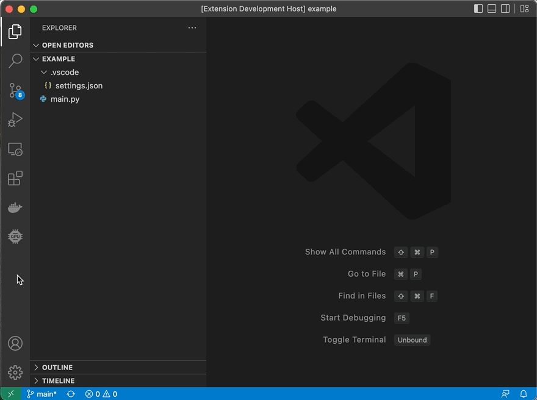
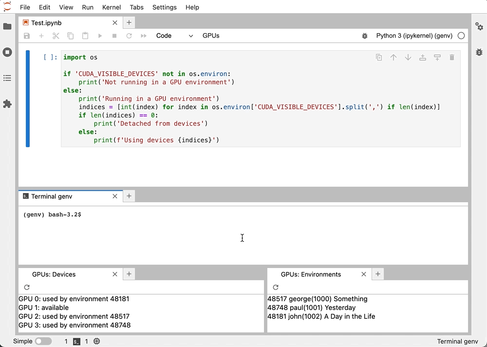

# GPU Environment Management

[](https://gitter.im/run-ai-genv/community?utm_source=badge&utm_medium=badge&utm_campaign=pr-badge&utm_content=badge)

*genv* lets you easily control, configure and monitor the GPU resources that you are using.

It is intendend to ease up the process of GPU allocation for data scientists without code changes 💪🏻

This project was highly inspired by [pyenv](https://github.com/pyenv/pyenv) and other version, package and environment management software like [Conda](https://docs.conda.io/projects/conda/en/latest/), [nvm](https://github.com/nvm-sh/nvm), [rbenv](https://github.com/rbenv/rbenv).


### Why You Should use *genv***

Because with *genv*, you will:

- Easily share GPUs with your teammates
- Find available GPUs for you to use - on-prem or on cloud via remote access
- Switch between GPUs without code changes
- Reserve GPU resources for as long as you use them with no one else hijacking them
- Reproduce your experiment environment easily
- Save time while collaborating

Plus, it's 100% free and gets installed before you can say Jack Robinson.

### Use it with your fav IDE

[Installation Guide for VSCode](https://github.com/run-ai/vscode-genv) | [Installation Guide for JupyterLab](https://github.com/run-ai/jupyterlab_genv)
:-------------------------:|:-------------------------:
  |  

A PyCharm integration is also in our roadmap so stay tuned!

## Table of Contents
* [Installation](#installation)
    * [Installation Guide for VSCode](https://github.com/run-ai/vscode-genv)
    * [Installation Guide for VSCode](https://github.com/run-ai/vscode-genv)
    * [Installation Guide for Terminal Usage](#from-source)
    * [License](#license)
* [Features](#/FEATURES.md/features)
    * [Environment Status](https://github.com/run-ai/genv/edit/feature/readme/FEATURES.md#environment-status)
    * [Activating an Environment](https://github.com/run-ai/genv/edit/feature/readme/FEATURES.md#activating-an-environment)
    * [Configuring an Environment](https://github.com/run-ai/genv/edit/feature/readme/FEATURES.md#configuring-an-environment)
        * [Device Count](https://github.com/run-ai/genv/edit/feature/readme/FEATURES.md#configure-the-device-count)
        * [Name](https://github.com/run-ai/genv/edit/feature/readme/FEATURES.md#configure-the-name)
        * [Printing the Configuration](https://github.com/run-ai/genv/edit/feature/readme/FEATURES.md#printing-the-current-configuration)
        * [Clearing the Configuration](https://github.com/run-ai/genv/edit/feature/readme/FEATURES.md#clearing-the-current-configuration)
        * [Configuration as Infrastructure-as-Code](https://github.com/run-ai/genv/edit/feature/readme/FEATURES.md#managing-configuration-as-infrastructure-as-code)
            * [Saving](https://github.com/run-ai/genv/edit/feature/readme/FEATURES.md#saving-configuration)
            * [Loading](https://github.com/run-ai/genv/edit/feature/readme/FEATURES.md#loading-configuration)
    * [Attach an Environment to Devices](https://github.com/run-ai/genv/edit/feature/readme/FEATURES.md#attach-an-environment-to-devices)
        * [Detaching](https://github.com/run-ai/genv/edit/feature/readme/FEATURES.md#detaching-an-environment)
        * [Reattaching](https://github.com/run-ai/genv/edit/feature/readme/FEATURES.md#reattaching-an-environment)
    * [List Environments](https://github.com/run-ai/genv/edit/feature/readme/FEATURES.md#list-environments)
    * [List Devices](https://github.com/run-ai/genv/edit/feature/readme/FEATURES.md#list-devices)
* [Advanced Features](https://github.com/run-ai/genv/edit/feature/readme/FEATURES.md#advanced-features)
    * [Multiple Terminals](https://github.com/run-ai/genv/edit/feature/readme/FEATURES.md#multiple-terminals)
* [Development](https://github.com/run-ai/genv/edit/feature/readme/DEVELOPMENT.md#development)
    * [Setup](https://github.com/run-ai/genv/edit/feature/readme/DEVELOPMENT.md#setup)
    * [Reference](https://github.com/run-ai/genv/edit/feature/readme/DEVELOPMENT.md#reference)

## Installation Guide for Terminal Usage

### From Source
It's super easy to get _genv_ as everything you need is to clone this Git repository into somewhere on your machine.
Your home directory is a great place to keep it:
```
git clone https://github.com/run-ai/genv.git ~/genv
```

#### Setting Up Your Shell
In order to use _genv_ you need to set up your shell environment with the following commands:
```
export PATH=$HOME/genv/bin:$PATH
eval "$(genv init -)"
```

You should add them to your `~/.bashrc` or any other equivalent file.

Afterward, for this to take effect, either reopen your terminal or restart your shell using the command:
```
exec $SHELL
```

To verify the installation worked, run the following command:
```
genv
```

You should be able to see all the available `genv` commands.

#### Dependencies
_genv_ uses Python 3 so make sure you have it also installed.

#### Uninstalling
To uninstall _genv_ simply remove the _genv_ directory:
```
rm -rf $(genv root)
```

You will also need to remove the commands you added to your `~/.bashrc` or any other equivalent file.


### License
The genv software is Copyright 2022 [Run.ai Labs, Ltd.].
The software is licensed by Run.ai under the AGPLv3 license.
Please note that Run.ai’s intention in licensing the software are that the obligations of licensee pursuant to the AGPLv3 license should be interpreted broadly.
For example, Run.ai’s intention is that the terms “work based on the Program” in Section 0 of the AGPLv3 license, and “Corresponding Source” in Section 1 of the AGPLv3 license, should be interpreted as broadly as possible to the extent permitted under applicable law.
