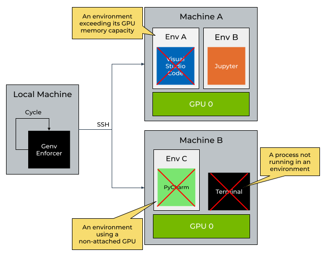
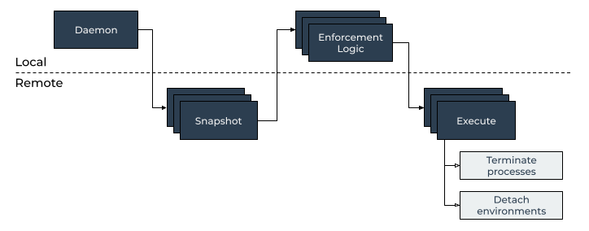

Enforcement
===========

.. contents::
   :depth: 2
   :backlinks: none

Overview
--------

   Genv remote enforcement overview

Before starting with remote enforcement features, it is highly recommended to go over the local enforcement features guide which is available :ref:`here <Enforcement>`.

Genv :doc:`remote features <./overview>` allow users and system administrators to provision GPU resources accross multiple machines.

Genv remote enforcement features allow users and system administrators to ensure that only the resources provisioned by Genv are being used using the command :code:`genv remote enforce`.

Permissions
-----------
As described later on in the :ref:`architecture <Remote Enforcement Architecture>` section, Genv both detaches environments from devices and terminates running processes on remote machines over SSH.

Detaching environments from devices is done by modifying the :code:`devices.json` :ref:`file <Files>`.
Because of how Genv creates these state files, all Linux users have access to modify them, hence all Linux users have permissions to detach environments of any Linux user.

On the other hand, Linux users usually can't terminate processes of other users or query their environment variables.

Therefore, the commands that :code:`genv remote enforce` executes on the remote machines over SSH for querying the environment variables of processes or terminating processes have to be executed using :code:`sudo` and are similar to the following:

.. code-block:: shell

   ssh <hostname> sudo genv ...

This means that your Linux user has to have paswordless :code:`sudo` permissions on all remote machines.
Otherwise, such commands will not work out of the box and will require a password to be entered which Genv does not support at the moment.

.. _Remote Enforcement Architecture:

Architecture
------------
Genv remote enforcement features work very similarly to local enforcement features.

The command :code:`genv remote enforce` acts as a foreground daemon, that is running in a while-loop and executes an enforcement cycle every once in a while.

   Genv remote enforcement cycle

Every cycle, Genv takes a snapshot of all the provisioned resources as well as the running GPU compute processes in real time by executing :code:`nvidia-smi` commands on all machines over SSH.

Then, Genv goes over the snapshots and runs different enforcement logics.
Every enforcement logic is responsible for one enforcement rule and checks if it is violated.

After running all enforcement logics, Genv combines all the conclusions and continues to the execution phase.

In the execution phase, it terminates running processes and detaches environments from devices on every machine according to the findings.
Running processes from environments on the devices that are being detached are also terminated.

.. note::

   Genv enforcer terminates only the GPU processes.
   This means that IDEs (e.g. Visual Studio Code, PyCharm, etc.) and terminals will not be terminated, but the running task processes such as :code:`python` processes or Jupyter kernels.

Running as a daemon
-------------------
The instructions to run Genv remote enforcement as a daemon are similar to the local enforcement instructions.
Follow them :ref:`here <Enforcement Daemon>`.

Make sure you are running on a machine that would not shutdown, restart or hybernate.
A personal laptop is not a good choice.

.. note::

   Make sure you use :code:`genv remote enforce` commands and not the local enforcement ones.

Enforcement Rules
-----------------
Enforcement rules are controlled using flags and arguments to :code:`genv remote enforce`.
You can also run :code:`genv remote enforce --help` to see all other supported flags and features.

The remote enforcement rules are similar to the :ref:`local enforcement rules <Enforcement Rules>`.
