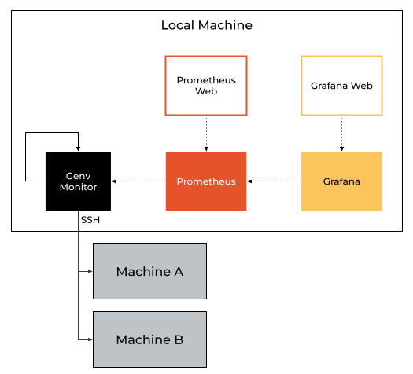

Monitoring
==========

.. contents::
   :depth: 3
   :backlinks: none

Overview
--------
Before starting with remote monitoring features, it is highly recommended to go over the local monitoring features guide which is available :doc:`here <../usage/monitoring>`.

Genv :doc:`remote features <overview>` allow users and system administrators to provision GPU resources accross multiple machines.

Genv remote monitoring features allow users and system administrators to monitor the resources and usage accross multiple machines using the command :code:`genv remote monitor`.

   Genv remote monitoring overview

Quick start
-----------
This is a guide to get started with remote monitoring features in Genv.

Prerequisites
~~~~~~~~~~~~~
First, you will need to :ref:`install <Install Using pip>` Genv on your local machine with the required packages for monitoring:

.. code-block:: shell

    pip install genv[monitor]

.. note::

    If you have already installed Genv without the monitor required packages, install them with:

    .. code-block:: shell

        pip install prometheus-client

Next, you will have to configure SSH access to remote GPU machines.

Go over the :ref:`remote installation overview <Remote Installation Overview>` and understand how Genv remote features work.
It is recommended to install Genv on the remote machines and configure their SSH daemons.
However, you can also use Genv remote monitoring to monitor GPU machines without Genv installed.
This allows system administrators to examine overall cluster utilization very easily.

In my case, I have two remote machines: :code:`gpu-server-1` and :code:`gpu-server-2`.

Make sure you have SSH access to all remote hosts and that the SSH configuration is set properly.
You can verify that using a command similar to this:

.. code-block:: shell

   ssh gpu-server-1 echo "hello from \$(hostname)"

.. warning::

   It is important that you verify the SSH access.
   If you can't access any of the remote hosts using a command similar to the one above, :code:`genv remote` commands will not work properly.

Running the monitoring service
~~~~~~~~~~~~~~~~~~~~~~~~~~~~~~
Now, start the monitoring service using the following command:

.. code-block:: shell

   genv remote -H gpu-server-1,gpu-server-2 monitor

.. note::

   :code:`genv remote monitor` acts as a foreground daemon and runs until a :code:`Ctrl+C` is received.
   Therefore, you will need to keep the terminal running while monitoring the system.

Prometheus
~~~~~~~~~~
The Prometheus instructions are similar to the local monitoring instructions.
Follow them :ref:`here <Monitoring Prometheus>`.

Now, you can open your browser at http://localhost:9090 and access Genv metrics from all remote hosts.

Grafana
~~~~~~~
The Grafana instructions are similar to the local monitoring instructions.
Follow them :ref:`here <Monitoring Grafana>`.

Now, you can open your browser at http://localhost:3000 and see the Genv dashboard with metrics from all remote hosts.

You should now see a dashboard similar to the following:

.. figure:: ../usage/monitoring-dashboard.png

   Genv monitoring dashboard

Running as a daemon
-------------------
The instructions to run Genv remote monitoring as a daemon are similar to the local monitoring instructions.
Follow them :ref:`here <Monitoring Daemon>`.

Make sure you are running on a machine that would not shutdown, restart or hybernate.
A personal laptop is not a good choice.

.. note::

   Make sure you use :code:`genv remote monitor` commands and not the local monitoring ones.

Reference
---------
The Genv remote monitoring service exports the same metrics as the local monitoring service with the additional label :code:`hostname`.

You can check out all the available metrics :ref:`here <Metrics Reference>`.
