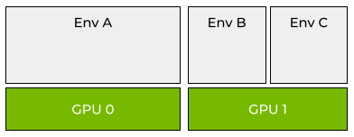
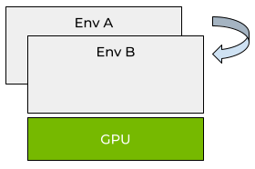

Advanced Usage
==============

.. contents::
   :depth: 2
   :backlinks: none

Multiple Terminals
------------------
When you activate an environment by running :code:`genv activate` in your terminal, a new environment gets created and registered.

Every activated terminal runs within an environment.

Genv supports running multiple terminals within the same environment.
This could be useful in many ways.
For example, when running an application in one terminal, and monitoring its GPU resources using :code:`nvidia-smi` in another terminal.

If you have an activated terminal and you want to open another terminal in the same environment, you need to first query the environment identifier using the command:

.. code-block:: shell

   echo $GENV_ENVIRONMENT_ID

Then, open another terminal and pass the argument :code:`--id` to your :code:`genv activate` command.
For example:

.. code-block:: shell

   genv activate --id 1667

Your terminal should now be activated in the same environment.
You could verify it by running :code:`nvidia-smi` and seeing information about the GPUs of your environment.

Genv automatically configures the terminal with the environment configuration and attaches the terminal to the devices that are attached to the environment.

.. _Using sudo:

Using :code:`sudo`
------------------
In some cases, you will need to run :code:`genv` commands as root using :code:`sudo`.
For example, if you want to use :doc:`enforcement <../usage/enforcement>` capabilities.

The best way to do this is by installing :ref:`using <Install Using pip>` :code:`sudo` and then using commands similar to the following:

.. code-block:: shell

   sudo -E env PATH=$PATH genv ...

If you can't install using :code:`sudo`, check out the workaround described :ref:`here <Install Without sudo>`.

.. warning::

   Shell commands like :code:`genv activate` should not be executed this way because they will not be able to manipulate the shell.

Explanation
~~~~~~~~~~~
Much of Genv functionality is based on environment variables.
You can see this by running the following command from an activated environment:

.. code-block:: shell

   env | grep GENV_

By default, when using :code:`sudo`, environment variables are not preserved.
You can see this by running the same command from an activated environment:

.. code-block:: shell

   sudo env | grep GENV_

This means that all that would not work when using :code:`sudo` from an activated environment.

To fix this, pass :code:`-E` or :code:`--preserve-env` to the :code:`sudo` command.
For example:

.. code-block:: shell

   sudo -E env | grep GENV_

In addition to that, some Genv functionality is implemented as :ref:`shims <Shims>`.
When applications such as :code:`nvidia-smi` and :code:`docker` are being executed inside an activated environment, their respective shims get called instead.
Genv modifies the environment variable :code:`PATH` to do so.

You can see this by running the following command from an activated environment:

.. code-block:: shell

   echo $PATH

When using :code:`sudo`, the environment variable :code:`PATH` is not preserved even when passing :code:`-E` or :code:`--preserve-env`.
You can see this by running the same command from an activated environment:

.. code-block:: shell

   sudo -E bash -c 'echo "$PATH"'

This means that shims would not be executed.

To solve this, you can explicitly preserve :code:`PATH` by passing :code:`env "PATH=$PATH"` after the :code:`sudo` command.
For example:

.. code-block:: shell

   sudo -E env "PATH=$PATH" bash -c 'echo "$PATH"'

Alternatively, if you don't want to preserve :code:`PATH`, you can just wrap the executed program with :code:`which`.
For example:

.. code-block:: shell

   sudo -E $(which nvidia-smi)

.. note::

   Make sure that you also pass :code:`-E` to preserve all Genv environment variables

.. _Install Without sudo:

Install Without :code:`sudo`
~~~~~~~~~~~~~~~~~~~~~~~~~~~~
If you can't install with :code:`sudo pip install`, commands like the following will fail:

.. code-block:: shell

   $ sudo -E env PATH=$PATH genv status
   sudo: genv: command not found

As a workaround, you can set the environment variable :code:`PYTHONPATH` with the path of the parent directory of the :code:`genv` Python package installation directory.
For example:

.. code-block::

   sudo -E env PATH=$PATH PYTHONPATH=$(python -c "import genv, pathlib; print(pathlib.Path(genv.__file__).resolve().parents[1])") genv status

Running Containers
------------------

.. note::

   This section talks about using :code:`docker` commands from an active environment and the :code:`docker` :ref:`shim <Shims>`.
   If you are interested in running containers as environments and not *from* environments, check out the :doc:`Genv container runtime <../docker/overview>`.

When running containers using a :code:`docker run` command from an active environment, the :code:`docker` :ref:`shim <Shims>` is executed.

It is responsible for making the container accessible to devices attached to the environment, as well as propagating some of Genv environment variables.

Thanks to these environment variables, processes running in such containers are marked as part of the active environment.
This is necessary when running :code:`nvidia-smi` in an active environment, as the :code:`nvidia-smi` :ref:`shim <Shims>` queries the environment variables of GPU consuming processes in order to identify the ones running in the same environment.

The problem is that containers can run as a different user than the shell they are executed in, and they typically run as root.

This means that permissions may be required in order to query processes running in containers, even when queried from the same shell that executed the container.
For example, when running :code:`nvidia-smi` from a non-root shell in an active environment, it will not be able to identify processes running in containers from the same environment if they run as root.

There are two ways to handle this issue.

The easiest way is to run :code:`nvidia-smi` with sufficient permissions :ref:`using <Using sudo>` :code:`sudo`:

.. code-block:: shell

   sudo -E env PATH=$PATH nvidia-smi

The other option is to run the container as non-root.
You can do that by passing :code:`--user $(id -u):$(id -g)` to the :code:`docker run` command, or by editing the Dockerfile.

Over-subscription
-----------------
Normally, the GPUs in the system are being provisioned to environments until they run out.

A GPU could be provisioned to a single environment, or can be shared between a few environments by :ref:`configuring <Configure the GPU Memory Capacity>` the environment memory capacity before attaching devices.

   Full- and shared-GPU provisioning with Genv

However, this could be wasteful as the provisioned GPUs can be unused some of the time, and in some cases, this amount of time can be significant.

For example, when writing GPU-consuming code (e.g. deep-learning model with PyTorch) using an IDE like Visual Studio Code, or PyCharm, the GPU resources are not being used in all the time that is spent on coding rather than running the application.

For this use case and similar ones, it is recommended to over-subscribe [#]_ the GPU by provisioning it to more than a single environment *without* setting a memory capacity.
Then, the entire GPU can be accessed by the different environments at different times, which will increase the resource utilization significantly.

   Over-provisioning with Genv

Attach with Over-subscription
~~~~~~~~~~~~~~~~~~~~~~~~~~~~~
By default, Genv does not over-subscribe GPUs.
This means that once a GPU is fully provisioned - either to a single environment or multiple ones - it cannot be attached anymore.

~~~~~
Shell
~~~~~
When running environments in the shell, to attach a GPU with over-subscription you will need to pass the argument :code:`-o` or :code:`--over-subscribe` to the :code:`genv attach` command.
For example:

.. code-block:: shell

   genv attach --index 0 -o

Another example:

.. code-block:: shell

   genv attach --count 2 --over-subscribe

~~~~~~~~~~
Containers
~~~~~~~~~~
When running containers using the :doc:`Genv container toolkit <../docker/overview>`, use the :code:`genv-docker` flag :code:`--over-subscribe`.
For example:

.. code-block:: shell

   genv-docker run -it --rm --gpus 1 --gpu-memory 4g --over-subscribe ubuntu

If you don't use :code:`genv-docker` but rather use the Genv container runtime directly, you can set the environment variable :code:`GENV_ALLOW_OVER_SUBSCRIPTION` to :code:`1`.
For more information check out the Genv container toolkit `README.md <https://github.com/run-ai/genv/blob/main/genv-docker/README.md>`__.

.. note::

   You should :doc:`install <../overview/installation>` Genv inside the container to use the :ref:`access control <Access Control>` mechanism.

.. _Access Control:

Access Control
~~~~~~~~~~~~~~
It is the responsibility of the users to access the over-subscribed GPU one at a time in order to avoid any OOM failures.

For this reason, Genv provides an access control mechanism, which can be used by the users to achieve the desired behavior.

.. warning::

   All environments must cooperate and use the Genv access control mechanism.
   There will be no effect if only some of the environments will and you will be exposed to OOM failures.

~~~~~~~~~~
Python SDK
~~~~~~~~~~
Import the :code:`genv` module and wrap your Python code with a call to :code:`genv.sdk.lock()`.
For example:

.. code-block:: python

   import genv

   with genv.sdk.lock():
      main()

.. note::

   For more information about the Python SDK see :doc:`here <./python-sdk>`.

~~~~~
Shell
~~~~~
Use the :code:`genv lock` command which works similarly to :code:`flock` [#]_.
For example:

.. code-block:: shell

   genv lock python main.py

.. [#] `Over-allocation - Wikipedia <https://en.wikipedia.org/wiki/Thin_provisioning#Over-allocation>`_
.. [#] `flock(1) - Linux manual page <https://man7.org/linux/man-pages/man1/flock.1.html>`_
