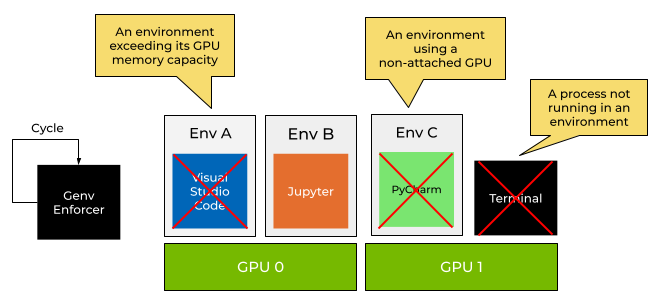
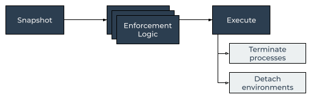

.. _Enforcement:

Enforcement
===========

.. contents::
   :depth: 3
   :backlinks: none

Overview
--------

   Genv enforcement overview

Genv provisions the GPU resources on a machine by attaching devices to environments.

It takes into account the available hardware as well as the environment configuration.
In the future, the usage in real time will also be taken into account for optimal decisions.

The provisioned resources are then bookkept in :ref:`state files <Files>` for as long as the environments are active or the resources are released, by detaching devices for example.

After provisioning the resources, Genv helps environments to use only their granted resources by manipulating the shell environment and by executing :ref:`shims <Shims>`.

However, all processes still technically have access to all devices and all their resources such as GPU memory, because these are bare-metal processes and not containers.

Genv supports enforcement features to allow users and system administrators to ensure that only the resources provisioned by Genv are being used by processes and environments using the command :code:`genv enforce`.

Note that to use enforcement capabilities on a machine that multiple users are sharing, you will need to run :code:`genv enforce` commands :ref:`using <Using sudo>` :code:`sudo`.

Quick start
-----------
This is a guide to get started with enforcement features in Genv.

Follow this tutorial and run the commands on a GPU machine with Genv installed.

You will need a GPU consuming application.
This could be Python code that uses TensorFlow, PyTorch, or any other application that you have.
We will be using a CUDA application called :code:`quickstart`.

We will go over two :ref:`enforcement rules <Enforcement Rules>` in this tutorial.

Non-environment Processes
~~~~~~~~~~~~~~~~~~~~~~~~~
Open a terminal on your GPU machine and run the application in the background:

.. code-block:: shell

   $ ./quickstart &
   [1] 63600

We can make sure that the application is indeed using GPU resources with :code:`nvidia-smi`:

.. code-block:: shell

   $ nvidia-smi
   ...
   +-----------------------------------------------------------------------------+
   | Processes:                                                                  |
   |  GPU   GI   CI        PID   Type   Process name                  GPU Memory |
   |        ID   ID                                                   Usage      |
   |=============================================================================|
   |    0   N/A  N/A     63600      C   ./quickstart                     7295MiB |
   +-----------------------------------------------------------------------------+

Now, we will run a :code:`genv enforce` command and ask it to terminate processes that are not running within environments.

.. code-block:: shell

   $ genv enforce --interval 0 --non-env-processes
   Process 63600 is not running in a GPU environment
   Terminating process 63600 from environment N/A that is running on GPU(s) 0
   [1]+  Terminated              ./quickstart

You can see that the process was terminated.
You can also verify it by running :code:`nvidia-smi` once again.

If you will activate an environment with attached devices (you can run :code:`genv activate --gpus 1`) and rerun all steps, you will see that now the process does not get terminated.

Max Devices per User
~~~~~~~~~~~~~~~~~~~~
Activate an environment and attach a device to it:

.. code-block:: shell

   $ genv activate --gpus 1

Let's verify that the environment is active and is attached to a device using :code:`genv devices`:

.. code-block:: shell

   $ genv devices
   ID      ENV ID      ENV NAME        ATTACHED
   0       67609                       42 seconds ago

Now run the application in the background as before:

.. code-block:: shell

   $ ./quickstart &
   [1] 67708

Now, we will run another :code:`genv enforce` command.
To start, we will allow each user to use one device.

.. code-block:: shell

   $ genv enforce --interval 0 --max-devices-per-user 1

We can see that nothing happened as we are using a single device which is allowed.

Let's rerun the command, but this time allow zero devices to be used:

.. code-block:: shell

   $ genv enforce --interval 0 --max-devices-per-user 0
   User raz is using 1 devices which is 1 more than the maximum allowed
   Terminating process 67708 from environment 67609 that is running on GPU(s) 0
   Detaching environment 67609 of user raz from device 0
   [1]+  Terminated              ./quickstart

You can see that the process was terminated and the environment was detached from the device.

To make sure the devices was detached from the environment, you can run :code:`genv devices`:

.. code-block:: shell

   $ genv devices
   ID      ENV ID      ENV NAME        ATTACHED
   0

Permissions
-----------
As described later on in the :ref:`architecture <Architecture>` section, Genv both detaches environments from devices and terminates running processes.

Detaching environments from devices is done by modifying the :code:`devices.json` :ref:`file <Files>`.
Because of how Genv creates these state files, all Linux users have access to modify them, therefore all Linux users have permissions to detach environments of any Linux user.

On the other hand, Linux users usually can't terminate processes of other users or query their environment variables.
Therefore, you will probably need to execute the :code:`genv enforce` commands :ref:`using <Using sudo>` :code:`sudo` with a command similar to the following:

.. code-block:: shell

   sudo genv enforce ...

.. _Architecture:

Architecture
------------
The command :code:`genv enforce` acts as a foreground daemon, that is running in a while-loop and executes an enforcement cycle every once in a while.

   Genv enforcement cycle

Every cycle, Genv takes a snapshot of all the provisioned resources as well as the running GPU compute processes in real time by executing :code:`nvidia-smi` commands.

Then, Genv goes over the snapshot and runs different enforcement rules.
Every enforcement rule checks if it is violated.

After running all enforcement rules, Genv combines all the conclusions and continues to the execution phase.

In the execution phase, it terminates running processes and detaches environments from devices according to the findings.
Running processes from environments on the devices that are being detached are also terminated.

.. note::

   Genv enforcer terminates only the GPU processes.
   This means that IDEs (e.g. Visual Studio Code, PyCharm, etc.) and terminals will not be terminated, but the running task processes such as :code:`python` processes or Jupyter kernels.

.. _Enforcement Rules:

Enforcement Rules
-----------------
Enforcement rules are controlled using flags and arguments to :code:`genv enforce`.
You can also run :code:`genv enforce --help` to see all other supported flags and features.

Non-environment Processes
~~~~~~~~~~~~~~~~~~~~~~~~~
Use the flag :code:`--non-env-processes` to terminate running processes that access a GPU and are not running within an environment.

This is mostly used for ensuring that no one runs GPU applications that are not managed by Genv on a machine.

This ensures that Genv is the only way that GPU resources are being provisioned in the system.

Environment Devices
~~~~~~~~~~~~~~~~~~~
Enabled by default.
Use the flag :code:`--env-devices` to terminate processes that are using devices which are not attached to their environments.

Environment Memory Capacity
~~~~~~~~~~~~~~~~~~~~~~~~~~~
Enabled by default.
Use the flag :code:`--env-memory` to terminate processes from environments that exceed their memory capacity.

Processes are terminated only from devices on which the environment is exceeding its memory capacity.
Not all processes are terminated, but a greedy algorithm terminates processes until enough memory was freed so that the environment does not exceed the capacity any more.

Max Devices per User
~~~~~~~~~~~~~~~~~~~~
Use the flag :code:`--max-devices-per-user <value>` to control how many devices each Linux user can access.

If a Linux user is using more devices than the specified value, some of his or her environments would get detached to free up resources.
Processes from the detached environments that are running on the detached devices would get terminated.
