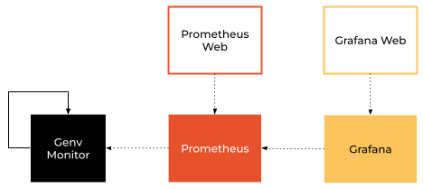
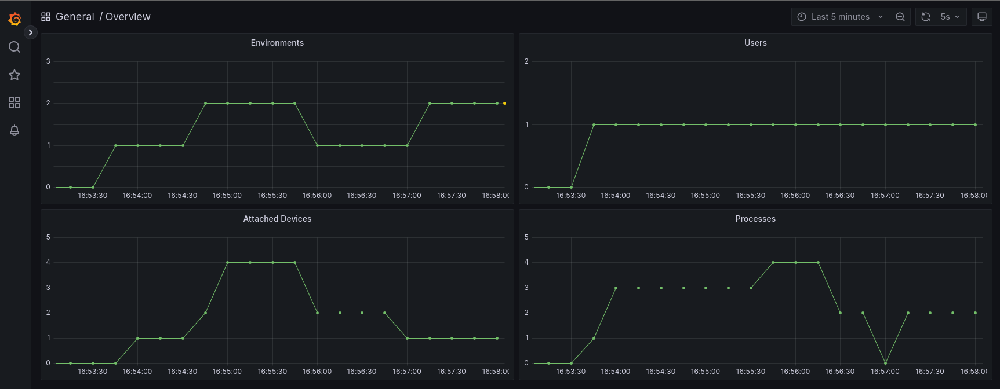

Monitoring
==========

.. contents::
   :depth: 3
   :backlinks: none

.. note::

  This article talks about monitoring the local machine only.
  For more information about how to monitor multiple machines, see :doc:`here <../remote/monitoring>`.

Overview
--------
Genv supports system and resource monitoring using `Prometheus <https://prometheus.io/>`__ and `Grafana <https://grafana.com/>`__.

   Genv monitoring overview

This is done with the Genv monitoring service that collects metrics about the system and resources and exports it in Prometheus format.

The monitoring service provides default configuration files for Prometheus and Grafana as well as a default Grafana dashboard.
This means that everything works as plug-and-play right out of the box.

Quick start
-----------
This is a guide to get started with monitoring features in Genv.

Prerequisites
~~~~~~~~~~~~~
First, you will need to install the :code:`prometheus-client` `PyPI package <https://pypi.org/project/prometheus-client>`__:

.. code-block:: shell

   pip install prometheus-client

.. note::

    This is installed automatically when installing Genv with :code:`pip install genv[monitor]`

Running the monitoring service
~~~~~~~~~~~~~~~~~~~~~~~~~~~~~~
Now, start the monitoring service using the following command:

.. code-block:: shell

   genv monitor

.. note::

   :code:`genv monitor` acts as a foreground daemon and runs until a :code:`Ctrl+C` is received.
   Therefore, you will need to keep the terminal running while monitoring the system.

.. _Monitoring Prometheus:

Prometheus
~~~~~~~~~~
First, `download <https://prometheus.io/download/>`__ the Prometheus precompiled binaries.

Then, open another terminal and unzip the archive file using the command:

.. code-block:: shell

   tar xvfz prometheus-*.tar.gz
   cd prometheus-*/

The Genv monitoring service publishes a configuration file for Prometheus.
By default, it is published at :code:`/var/tmp/genv/metrics/prometheus/prometheus.yml`.

You can see its contents using :code:`cat`:

.. code-block:: shell

   $ cat /var/tmp/genv/metrics/prometheus/prometheus.yml
   global:
     scrape_interval: 15s
     evaluation_interval: 15s

   scrape_configs:
   - job_name: genv
     static_configs:
       - targets: ['localhost:8000']

This essentially tells Prometheus to scrape the Genv exporter which is available at port 8000 thanks to the monitoring service we ran using the command :code:`genv monitor`.

Now, let's run Prometheus and specify the configuration file path:

.. code-block:: shell

    ./prometheus --config.file=/var/tmp/genv/metrics/prometheus/prometheus.yml

Now, you can open your browser at http://localhost:9090 and access Genv metrics.

.. _Monitoring Grafana:

Grafana
~~~~~~~
First, open another terminal and `download and extract <https://grafana.com/grafana/download>`__ the Grafana precompiled binaries.
Then, enter the directory:

.. code-block:: shell

    cd grafana-*/

The Genv monitoring service publishes a configuration file for Grafana.
By default, it is published at :code:`/var/tmp/genv/metrics/grafana/grafana.ini`.

You can see its contents using :code:`cat`:

.. code-block:: shell

   $ cat /var/tmp/genv/metrics/grafana/grafana.ini
   [auth.anonymous]
   enabled = true
   org_name = Main Org.
   org_role = Viewer

   [paths]
   provisioning = /var/tmp/genv/metrics/grafana/provisioning

   [dashboards]
   default_home_dashboard_path=/var/tmp/genv/metrics/grafana/dashboards/overview.json

This essentially tells Grafana where its datasources and dashboards are, as well as configures the default dashboard.

As mentioned before, the Genv monitoring service also provides a Prometheus data source as well as dashboards.
You can see the contents of :code:`/var/tmp/genv/metrics/grafana` using :code:`find`:

.. code-block:: shell

   find /var/tmp/genv/metrics/grafana
   /var/tmp/genv/metrics/grafana
   /var/tmp/genv/metrics/grafana/dashboards
   /var/tmp/genv/metrics/grafana/dashboards/overview.json
   /var/tmp/genv/metrics/grafana/provisioning
   /var/tmp/genv/metrics/grafana/provisioning/datasources
   /var/tmp/genv/metrics/grafana/provisioning/datasources/default.yml
   /var/tmp/genv/metrics/grafana/provisioning/dashboards
   /var/tmp/genv/metrics/grafana/provisioning/dashboards/default.yml
   /var/tmp/genv/metrics/grafana/grafana.ini

Now, let's run Grafana and specify the configuration file path:

.. code-block:: shell

   ./bin/grafana-server --config /var/tmp/genv/metrics/grafana/grafana.ini web

Now, you can open your browser at http://localhost:3000 and see the Genv dashboard.
You should now see a dashboard similar to the following:

   Genv monitoring dashboard

.. _Metrics Reference:

Reference
---------

.. list-table::
   :header-rows: 1

   * - Metric
     - Labels
     - Description
   * - :code:`genv_device_utilization`\*
     - :code:`index`
     - Device utilization
   * - :code:`genv_device_memory_used_bytes`\*
     - :code:`index`
     - Device used memory in bytes
   * - :code:`genv_environments_total`
     -
     - Number of active environments
   * - :code:`genv_processes_total`
     -
     - Number of running processes
   * - :code:`genv_attached_devices_total`
     -
     - Number of attached devices
   * - :code:`genv_users_total`
     -
     - Number of active users
   * - :code:`genv_environment_processes_total`
     - :code:`eid`
     - Number of running processes in an environment
   * - :code:`genv_environment_attached_devices_total`
     - :code:`eid`
     - Number of attached devices of an environment
   * - :code:`genv_process_devices_total`
     - :code:`pid`, :code:`eid`
     - Number of devices used by a process
   * - :code:`genv_process_used_gpu_memory_bytes`
     - :code:`pid`, :code:`eid`, :code:`device`
     - Used GPU memory by a process
   * - :code:`genv_user_environments_total`
     - :code:`username`
     - Number of active environments of a user
   * - :code:`genv_user_processes_total`
     - :code:`username`
     - Number of running processes of a user
   * - :code:`genv_user_attached_devices_total`
     - :code:`username`
     - Number of attached devices of a user

\* *Not yet exported*
